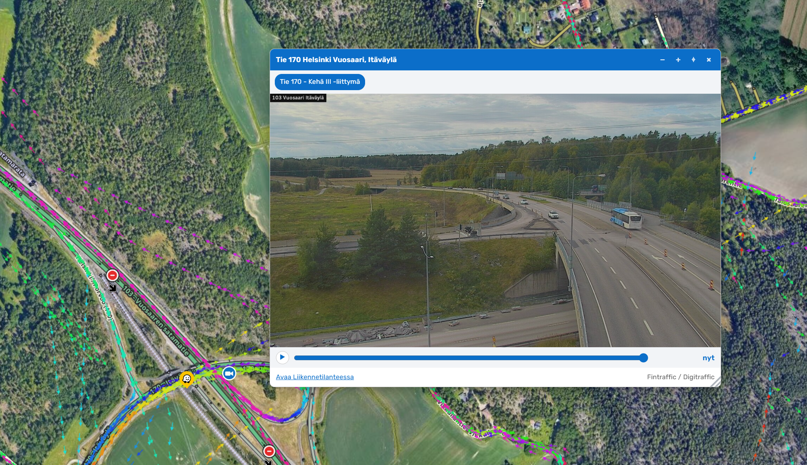

# WME Kelikamerat

Tampermonkey-lisäosa Waze Map Editorille (WME), joka näyttää Fintrafficin liikenne- ja kelikamerat kartalla ja avaa kameran kuvan suoraan editorissa.

Lisäosa on tarkoitettu maastotarkistuksen apuvälineeksi: liittymän muodon, kaistojen, opasteiden tai tietyön voi varmistaa kameran kuvasta poistumatta WME:stä. Mukana on viimeisen 24 tunnin kuvahistoria, joten pimeään aikaan avatun kameran voi kelata päivänvaloon.

> **Huom:** Kamerat sijaitsevat lähes yksinomaan pää- ja seututeillä. Katuverkon editointiin aineistosta ei ole apua.

---

## Ominaisuudet

- Näyttää Fintrafficin kelikamerat kartalla omalla tasollaan.
- Kameran klikkaus avaa ikkunan, jossa näkyy tuorein kuva.
- Kameran kaikki kuvaussuunnat välilehtinä selkokielisin nimin.
- Viimeisen 24 tunnin kuvahistoria liukusäätimellä.
- Toistopainike selaa historiakuvat automaattisesti läpi.
- Kuva päivittyy automaattisesti kahden minuutin välein.
- Vikatilassa olevat kamerat näkyvät kartalla harmaana.
- Ikkuna on siirrettävissä ja kokoa voi muuttaa; asetukset säilyvät.
- Linkki kameran omalle sivulle Fintrafficin Liikennetilanne-palveluun.
- Välimuisti vähentää rajapintakutsuja (24 tunnin TTL).

---

## Toimintalogiikka

Lisäosa toimii seuraavasti:

1. Hakee käynnistyessään kaikkien kamera-asemien sijainnit yhdellä kutsulla.
2. Piirtää näkyvällä kartta-alueella olevat kamerat zoomitasosta 12 alkaen.
3. Lukee aseman tilatiedot ja merkitsee vikatilassa olevat harmaalla.
4. Hakee kameran tarkemmat tiedot vasta kun sitä klikataan.
5. Lataa kuvan taustalla ja näyttää sen ikkunassa.
6. Tarkistaa ETagin avulla, onko kuva päivittynyt, ennen kuin lataa sen uudelleen.
7. Hakee kuvahistorian vasta, kun liukusäätimeen tartutaan.

---

## Värit kartalla

| Väri | Merkitys |
| ---- | -------- |
| 🔵 Sininen | Kamera toimii normaalisti |
| ⚫ Harmaa | Kamerassa on vahvistettu vika tai se on tilapäisesti poissa keruusta |

Vikatilassa olevan kameran ikkunassa näkyy lisäksi keltainen huomautus ja otsikkopalkki on harmaa.

---

## Ikkunan toiminnot

| Painike | Toiminto |
| ------- | -------- |
| `−` | Pienentää ikkunaa |
| `+` | Suurentaa ikkunaa |
| `⌖` | Palauttaa oletuskoon ja automaattisen sijoittelun |
| `×` | Sulkee ikkunan |
| `▶` | Toistaa historiakuvat |

Ikkunaa siirretään otsikkopalkista raahaamalla ja kokoa muutetaan oikeasta alakulmasta. Kun ikkunaa on kerran siirretty käsin, se pysyy paikallaan myös seuraavia kameroita avattaessa.

---

## Kuvahistoria

Liukusäädin on aina näkyvissä kuvan alapuolella. Oikea ääriasento tarkoittaa nykyhetkeä, ja siitä vasemmalle kelataan taaksepäin enintään vuorokausi.

- Historialista haetaan vasta, kun hiiri viipyy säätimen päällä tai siihen tartutaan.
- Kelattaessa kuvan kellonaika näkyy säätimen oikealla puolella.
- Automaattinen päivitys on käytössä vain nykyhetkessä.
- Toisto etenee viisi kuvaa sekunnissa ja päättyy tuoreimpaan kuvaan.
- Toisto pysähtyy, jos säätimeen tartutaan, esiasento vaihdetaan tai välilehti menee taustalle.

---

## Asennus

### 1. Tarkista

[Aloitusopas](https://github.com/samisepp/Waze-Finland-Scripts/blob/digitraffic/docs/getting-started.md)

### 2. Asenna skripti

Luo uusi Tampermonkey-skripti ja liitä tämän projektin sisältö siihen.

Rajapinta ei vaadi API-avainta eikä rekisteröitymistä.

### 3. Avaa Waze Map Editor

Lisäosa lisää tasovalikkoon uuden rastin:

**Kelikamerat**

Kamerat ilmestyvät kartalle zoomitasosta 12 alkaen.

---

## Välimuisti

Tulokset tallennetaan selaimen paikalliseen tallennustilaan:

| Avain | Sisältö | Säilytysaika |
| ----- | ------- | ------------ |
| `wmeKelikamerat_v5_asemat` | Kaikkien asemien sijainnit ja tilat | 24 h |
| `wmeKelikamerat_v5_asema_*` | Aseman esiasennot ja nimet | 24 h |
| `wmeKelikamerat_ui` | Ikkunan koko ja sijainti | pysyvä |

Avaimet on versioitu. Kun tallennettavan tiedon rakenne muuttuu, versionumero nousee ja vanhat avaimet poistetaan automaattisesti käynnistyksessä.

---

## Suorituskyky

- Asemalista haetaan kerran istunnossa, ei kartan liikkuessa.
- Kartalle piirretään enintään 400 kameraa kerrallaan.
- Aseman tarkemmat tiedot ja kuvahistoria haetaan vasta tarvittaessa.
- Toiston kehykset pidetään muistissa (enintään 80 kuvaa) ja vapautetaan ikkunan sulkeutuessa.
- Kuvan päivitys käyttää ehdollista HTTP-pyyntöä, joten muuttumaton kuva ei siirrä kuvadataa lainkaan.
- Automaattinen päivitys on pois päältä, kun selaimen välilehti ei ole näkyvissä.

---

## Vianetsintä

Konsolista löytyy apuobjekti:

```js
WMEKelikamerat.asemat()        // ladatut kamera-asemat
WMEKelikamerat.tyhjennaKaikki() // nollaa välimuisti
```

Skriptin omat viestit näkyvät konsolissa etuliitteellä `[Kelikamerat]`.

---

## Tunnetut rajoitukset / ongelmat

- Kameroiden kuvaussuuntaa ei näytetä. Rajapinnan suuntatieto on niin puutteellista, että se johtaisi useammin harhaan kuin auttaisi.
- Kuvahistorian pituus vaihtelee kameroittain. Jos kamera on ollut poissa käytöstä, koko vuorokautta ei välttämättä ole saatavilla.
- Rajapinta ei kerro, milloin kamera on siirretty tai suunnattu uudelleen. Vanha historiakuva voi siis esittää eri näkymää kuin tuorein kuva.
- Kamerakuvat päivittyvät noin 10 minuutin välein, joten kuva ei koskaan ole täysin reaaliaikainen.

---

## Screenshots



---

## Versiohistoria

### 0.10.1

- Ensimmäinen julkaisu

---

## Tietolähteet ja lisenssi

Kamerat ja kuvat: Fintraffic / Digitraffic, lisenssi [CC BY 4.0](https://creativecommons.org/licenses/by/4.0/deed.fi).

Rajapinnan dokumentaatio: <https://www.digitraffic.fi/tieliikenne/>

Skriptin lisenssi: MIT License
