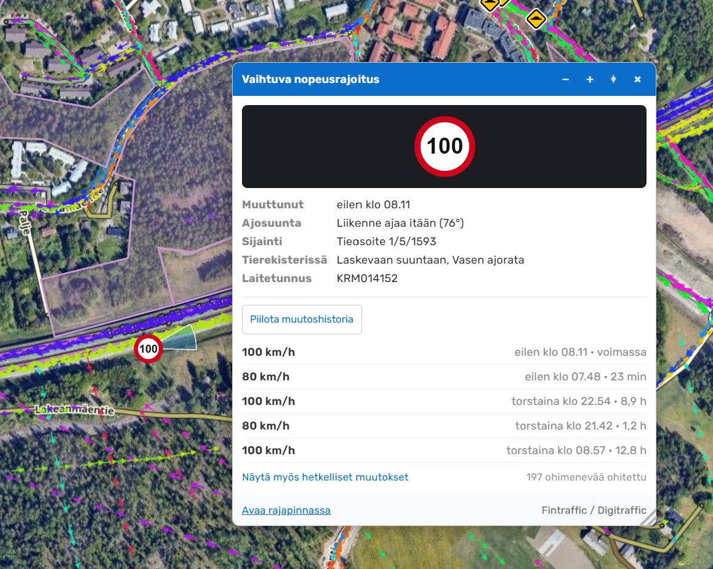
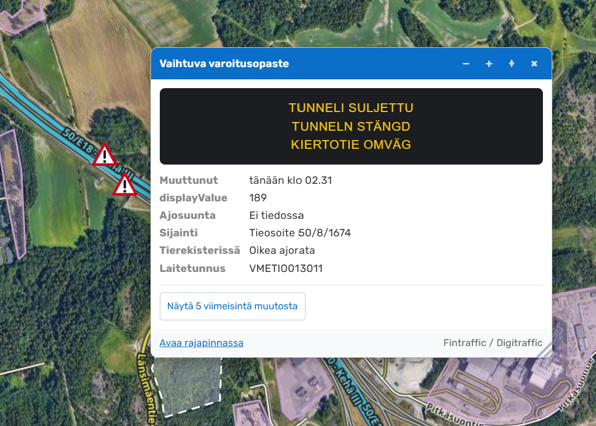

# WME Vaihtuvat opasteet

Tampermonkey-lisäosa Waze Map Editorille (WME), joka näyttää Fintrafficin vaihtuvat nopeusrajoitus- ja varoitusopasteet kartalla.

Nopeusrajoitusopaste piirtyy kartalle oikeana liikennemerkkinä, jossa lukee sillä hetkellä voimassa oleva rajoitus. Lisäosa kertoo myös selkokielisesti, kumpaan suuntaan opasteen liikenne kulkee — tierekisterin "laskeva suunta" ja "vasen ajorata" eivät kerro sitä editorille mitään.

> **Huom:** Vaihtuva nopeusrajoitus ei ole sama asia kuin segmentin nopeusrajoitus WME:ssä. Opaste kertoo hetkellisen arvon, joka vaihtelee kelin ja liikennetilanteen mukaan. Älä siis päivitä segmentin rajoitusta opasteen näyttämän arvon perusteella.

---

## Ominaisuudet

- Vaihtuvat nopeusrajoitukset ja varoitusopasteet omilla tasoillaan.
- Nopeusrajoitus näkyy kartalla oikeana liikennemerkkinä lukuarvoineen.
- Pimeänä oleva opaste erottuu harmaana ja tyhjänä.
- Lämpötilaa näyttävät taulut tunnistetaan ja merkitään omalla ikonilla.
- Epäluotettavassa tilassa oleva opaste näkyy himmennettynä.
- Opasteen klikkaus avaa ikkunan, jossa näytön sisältö esitetään sellaisenaan.
- Ajosuunta selkokielisenä ilmansuuntana ja sektorina kartalla.
- Viisi viimeisintä todellista muutosta laitteen historiasta.
- Ikkuna on siirrettävissä ja kokoa voi muuttaa; asetukset säilyvät.
- Data päivittyy automaattisesti viiden minuutin välein.

---

## Toimintalogiikka

Lisäosa toimii seuraavasti:

1. Hakee kaikki vaihtuvat opasteet yhdellä kutsulla.
2. Tarkistaa koordinaattien järkevyyden ja hylkää virheelliset piirteet.
3. Jakaa opasteet tyypin mukaan nopeusrajoituksiin ja varoitusopasteisiin.
4. Päättelee näytön sisällöstä, onko opaste pimeänä tai näyttääkö se pelkkää lämpötilaa.
5. Piirtää näkyvällä kartta-alueella olevat opasteet zoomitasosta 12 alkaen.
6. Hakee klikatun opasteen ajosuunnan Väyläviraston tieosoiteverkosta.
7. Hakee muutoshistorian vasta, kun sitä pyydetään.

---

## Symbolit kartalla

| Symboli | Merkitys |
| ------- | -------- |
| ⭕ Punareunainen ympyrä lukuarvolla | Voimassa oleva vaihtuva nopeusrajoitus |
| 🔺 Punareunainen kolmio | Varoitus- tai tekstiopaste, jolla on sisältöä |
| ⚪ Harmaa tyhjä ympyrä | Nopeusrajoitusopaste pimeänä |
| △ Harmaa tyhjä kolmio | Varoitusopaste pimeänä |
| 🌡 Harmaa °C-laatta | Taulu näyttää pelkkää ilman ja tien lämpötilaa |
| ❓ Kysymysmerkki | Nopeusarvo, jolle ei ole omaa ikonia |

Harmaa reunus punaisen sijaan tarkoittaa, ettei opasteen tila ole luotettava. Ikonit on piirretty arvoille 20–120 kymmenen välein.

---

## Ajosuunta

Rajapinta kertoo suunnan tierekisterin käsittein: kasvava tai laskeva suunta ja oikea tai vasen ajorata. Kumpikaan ei ole tulkittavissa kartalta.

Lisäosa hakee tien geometrian Väyläviraston tieosoiteverkosta opasteen kohdalta ja laskee siitä tien suuntakulman. Koska tieosoiteverkko on digitoitu tieosoitteen kasvavaan suuntaan, kasvava suunta saa tangentin sellaisenaan ja laskeva suunta sen plus 180 astetta.

Lopputulos näkyy ikkunassa muodossa **"Liikenne ajaa lounaaseen (213°)"** ja kartalla sinisenä sektorina opasteen kohdalla.

Tierekisterin alkuperäiset arvot näkyvät edelleen omalla rivillään, koska niitä tarvitaan Väyläviraston aineistojen kanssa työskennellessä.

---

## Muutoshistoria laitteesta

Rajapinnan raakahistoria on käyttökelvoton sellaisenaan: siinä on satoja peräkkäisiä rivejä samalla arvolla sekä laitteen testisekvenssejä, joissa arvo käy 70 → 30 → 70 neljässäkymmenessä sekunnissa.

Lisäosa tiivistää listan kahdessa vaiheessa:

1. Peräkkäiset samanarvoiset rivit yhdistetään yhdeksi tilaksi, jolle lasketaan alkuhetki ja kesto.
2. Alle kahden minuutin mittaiset tilat karsitaan ja lista kootaan uudelleen, kunnes se ei enää muutu.

Käytännössä 46 raakariviä tiivistyy kuudeksi todelliseksi muutokseksi. Listan alta löytyy linkki, jolla myös hetkelliset muutokset saa näkyviin.

---

## Asennus

### 1. Tarkista

[Aloitusopas](https://github.com/samisepp/Waze-Finland-Scripts/blob/digitraffic/docs/getting-started.md)

### 2. Asenna skripti

Luo uusi Tampermonkey-skripti ja liitä tämän projektin sisältö siihen.

Kumpikaan käytetty rajapinta ei vaadi API-avainta. Tampermonkey kysyy asennuksen yhteydessä luvan kahteen osoitteeseen: `tie.digitraffic.fi` ja `avoinapi.vaylapilvi.fi`.

### 3. Avaa Waze Map Editor

Lisäosa lisää tasovalikkoon kaksi rastia:

- **Vaihtuvat nopeusrajoitukset**
- **Vaihtuvat varoitusopasteet**

Opasteet ilmestyvät kartalle zoomitasosta 12 alkaen.

---

## Välimuisti

| Avain | Sisältö | Säilytysaika |
| ----- | ------- | ------------ |
| `wmeOpasteet_v1_suunta_*` | Opasteen laskettu ajosuunta | 30 vrk |
| `wmeOpasteet_ui` | Ikkunan koko ja sijainti | pysyvä |

Itse opastedataa ei tallenneta pysyvästi, koska se muuttuu jatkuvasti. Se pidetään muistissa minuutin ajan ja päivitetään viiden minuutin välein.

---

## Suorituskyky

- Opasteet haetaan yhdellä kutsulla, ei kartan liikkuessa.
- Kartalle piirretään enintään 500 opastetta tasoa kohti.
- Ajosuunta lasketaan kerran laitetta kohti ja säilyy välimuistissa 30 vuorokautta.
- Muutoshistoria haetaan vain pyydettäessä ja säilyy muistissa viisi minuuttia.
- Automaattinen päivitys on pois päältä, kun selaimen välilehti ei ole näkyvissä.

---

## Vianetsintä

Konsolista löytyy apuobjekti:

```js
WMEOpasteet.opasteet()          // jäsennetyt opasteet
WMEOpasteet.raaka('KRM043951')  // rajapinnan alkuperäiset kentät
WMEOpasteet.ajosuunta('KRM043951')
WMEOpasteet.historia('KRM043951')
WMEOpasteet.pimeat()            // pimeäksi tulkitut laitetunnukset
WMEOpasteet.lampotilat()        // lämpötilatauluiksi tulkitut
WMEOpasteet.paivita()           // pakota uusi haku
```

Skriptin omat viestit näkyvät konsolissa etuliitteellä `[Opasteet]`. Lisäosa kirjaa kerran jokaisen havaitsemansa tuntemattoman arvon: uudet opastetyypit, uudet `reliability`-arvot, nopeudet joilta puuttuu ikoni sekä lämpötilarivit, joista jää tunnistamaton sana.

---

## Tunnetut rajoitukset / ongelmat

- Digitraffic julkaisee vain laiteryhmän isäntälaitteen datan. Tien vasemman puolen ja ramppien orjalaitteet puuttuvat, joten kaksiajorataisella tiellä näkyy usein vain toisen suunnan opaste.
- Ajosuunta jää päättelemättä, jos opaste ei ole tieosoiteverkon kattamalla maantiellä.
- Tieosoiteverkon attribuuttinimiä ei ole varmistettu dokumentaatiosta, joten tienumeron tunnistus kokeilee useaa vaihtoehtoista kentän nimeä. Risteysalueella lähin viiva voi olla väärä tie.
- Lämpötilataulujen tunnistus perustuu tekstin sisältöön. Kaksikieliset ja poikkeavat muodot on huomioitu, mutta uusi sanamuoto voi jäädä tunnistamatta. Tunnistamaton jäännös kirjataan konsoliin.
- `reliability`-kentän sallittuja arvoja ei ole dokumentoitu. Lisäosa pitää luotettavana vain arvoa `NORMAL` ja kaikkea muuta epävarmana.
- Sekamuotoinen taulu, jossa on sekä lämpötila että varoitus, luokitellaan varoitukseksi. Hyödyllistä tietoa ei siis piiloteta lämpötilaikonin taakse.

---

## Screenshots




---

## Versiohistoria

### 0.6.0

- Ensimmäinen julkaisu.

---

## Tietolähteet ja lisenssi

Opasteet: Fintraffic / Digitraffic, lisenssi [CC BY 4.0](https://creativecommons.org/licenses/by/4.0/deed.fi).

Tieosoiteverkko: Väylävirasto, lisenssi [CC BY 4.0](https://creativecommons.org/licenses/by/4.0/deed.fi).

Rajapintojen dokumentaatio:

- <https://www.digitraffic.fi/tieliikenne/>
- <https://vayla.fi/vaylista/aineistot/avoindata>

Skriptin lisenssi: MIT License
